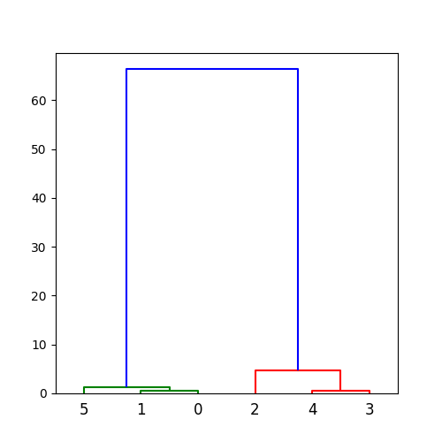

# HC

Hierarchical Clustering in `python3`, (used my library [Matrix7](https://github.com/LogX7/Matrix7))

## requirements

```bash
pip install matplotlib scipy numpy
```

## usage

```bash
python main.py
```

### example

- input :

```python
# 2 coordinates, 6 samples
I = [
    [1, 1],
    [1, 2],
    [1, 6],
    [1, 8],
    [1, 9],
    [2, 1],
]
```

- output :

```text
/|      0      1      2      3      4      5
0|   0.00   0.50  12.50  24.50  32.00   0.50 |
1|   0.50   0.00   8.00  18.00  24.50   1.00 |
2|  12.50   8.00   0.00   2.00   4.50  13.00 |
3|  24.50  18.00   2.00   0.00   0.50  25.00 |
4|  32.00  24.50   4.50   0.50   0.00  32.50 |
5|   0.50   1.00  13.00  25.00  32.50   0.00 |

/|      6      2      3      4      5
6|   0.00  14.00  28.67  38.00   1.33 |
2|  14.00   0.00   2.00   4.50  13.00 |
3|  28.67   2.00   0.00   0.50  25.00 |
4|  38.00   4.50   0.50   0.00  32.50 |
5|   1.33  13.00  25.00  32.50   0.00 |

/|      7      6      2      5
7|   0.00  50.00   4.67  38.67 |
6|  50.00   0.00  14.00   1.33 |
2|   4.67  14.00   0.00  13.00 |
5|  38.67   1.33  13.00   0.00 |

/|      8      7      2
8|   0.00  63.60  17.75 |
7|  63.60   0.00   4.67 |
2|  17.75   4.67   0.00 |

/|      9      8
9|   0.00  66.33 |
8|  66.33   0.00
```

